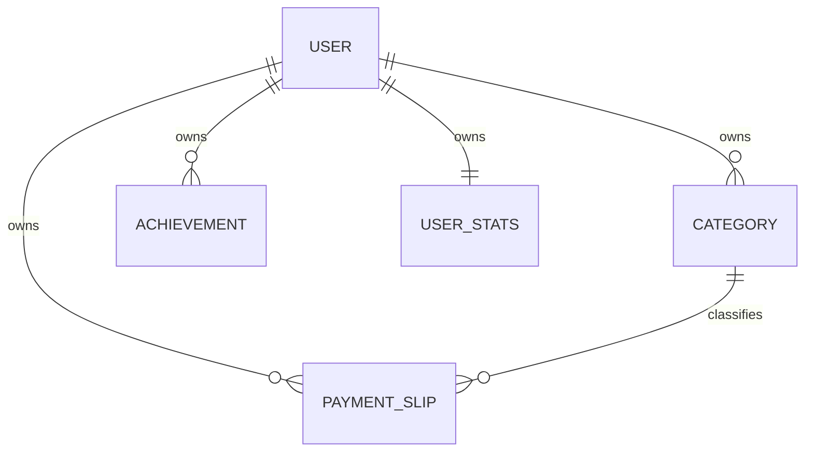

# Database Schema & Models: PostgreSQL Migration

## Prisma Schema Representation

```prisma
datasource db {
  provider = "postgresql"
  url      = env("DATABASE_URL")
  directUrl = env("DIRECT_URL")
}

enum SlipStatus {
  PAGO
  PENDENTE
}

model User {
  id        String   @id @default(uuid())
  username  String   @unique
  createdAt DateTime @default(now())

  categories   Category[]
  slips        PaymentSlip[]
  achievements Achievement[]
  stats        UserStats?
}

model Category {
  id              String        @id @default(uuid())
  name            String
  colorCode       String
  iconRef         String
  isSystemDefault Boolean       @default(false)
  createdAt       DateTime      @default(now())
  
  userId          String?
  user            User?         @relation(fields: [userId], references: [id], onDelete: Cascade)
  
  slips           PaymentSlip[]

  @@unique([name, userId])
}

model PaymentSlip {
  id                  String     @id @default(uuid())
  title               String
  amount              Float
  dueDate             DateTime
  status              SlipStatus @default(PENDENTE)
  isCreditCardPayment Boolean    @default(false)
  documentPath        String?
  createdAt           DateTime   @default(now())

  categoryId          String
  category            Category   @relation(fields: [categoryId], references: [id], onDelete: Restrict)

  userId              String
  user                User       @relation(fields: [userId], references: [id], onDelete: Cascade)
}

model Achievement {
  id                 String    @id @default(uuid())
  title              String
  description        String
  type               String
  conditionValue     Float
  isUnlocked         Boolean   @default(false)
  progressPercentage Float     @default(0.0)
  unlockedAt         DateTime?

  userId             String
  user               User      @relation(fields: [userId], references: [id], onDelete: Cascade)

  @@unique([title, userId])
}

model UserStats {
  id                 String    @id // Maps directly to User.id
  monthlyBudgetLimit Float     @default(2000.0)
  totalCreditLimit   Float     @default(1000.0)
  currentStreakDays  Int       @default(0)

  user               User      @relation(fields: [id], references: [id], onDelete: Cascade)
}
```

## Entity Relations Mapping



- **User**: The root profile entity. Every device login selects/creates a `User` by username.
- **Category**: Scoped. If `userId` is `null`, it represents a system-wide default category. When a user logs in, they see all default categories plus their custom categories.
- **PaymentSlip**: Scoped. Strictly tied to a `User` and categorized. `status` uses the `SlipStatus` enum.
- **Achievement**: Tracked individually per user. Cloned from initial definitions when a user is first created.
- **UserStats**: Stores streaks and configurations, uniquely identified by the `userId`.
